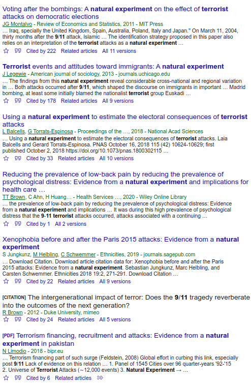
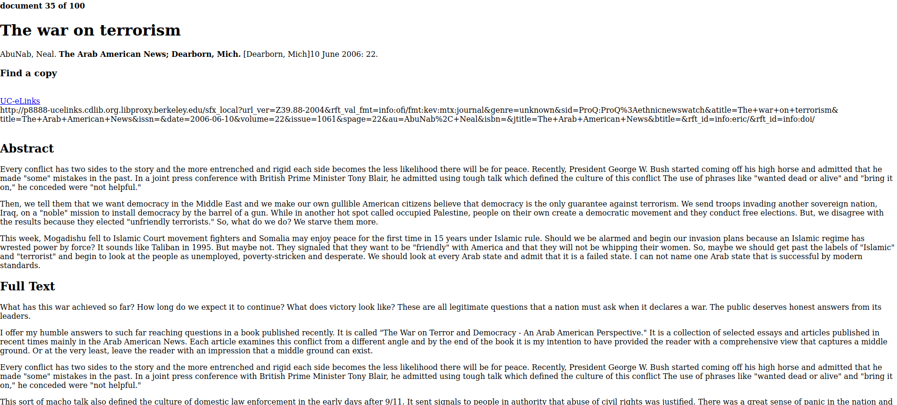
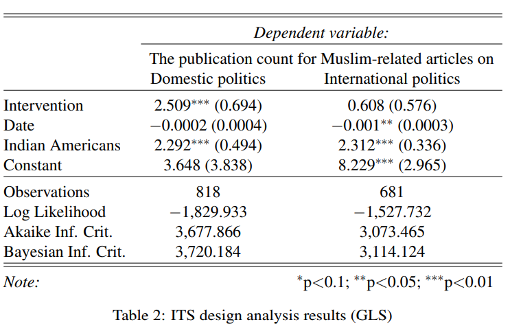
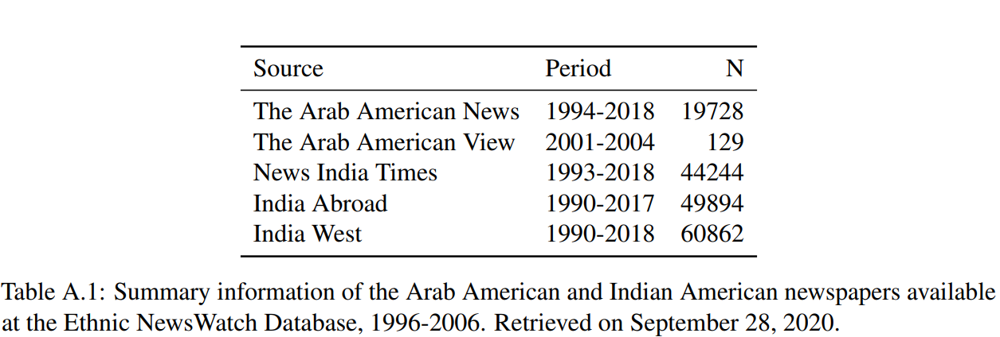
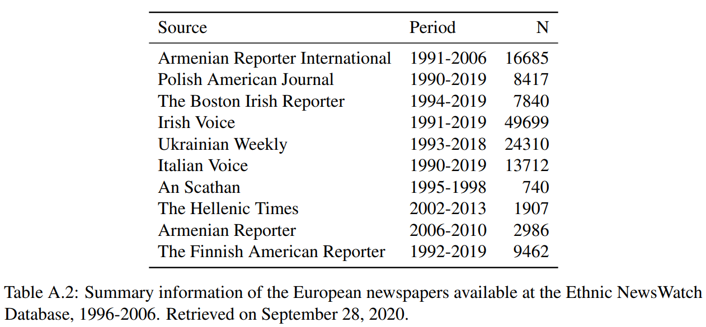
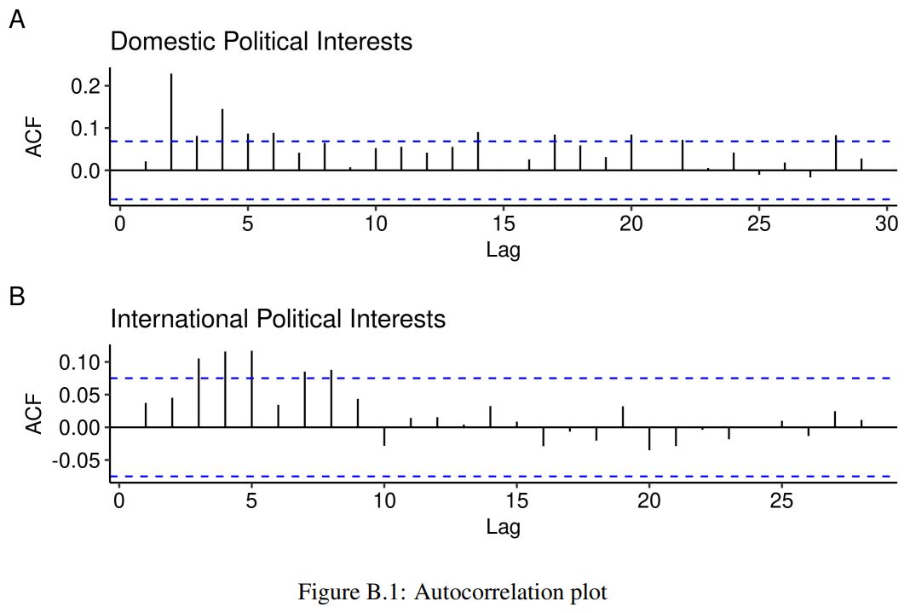
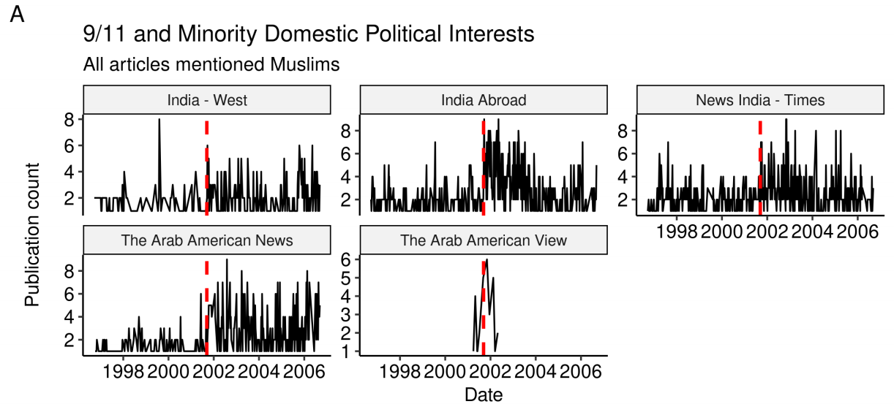
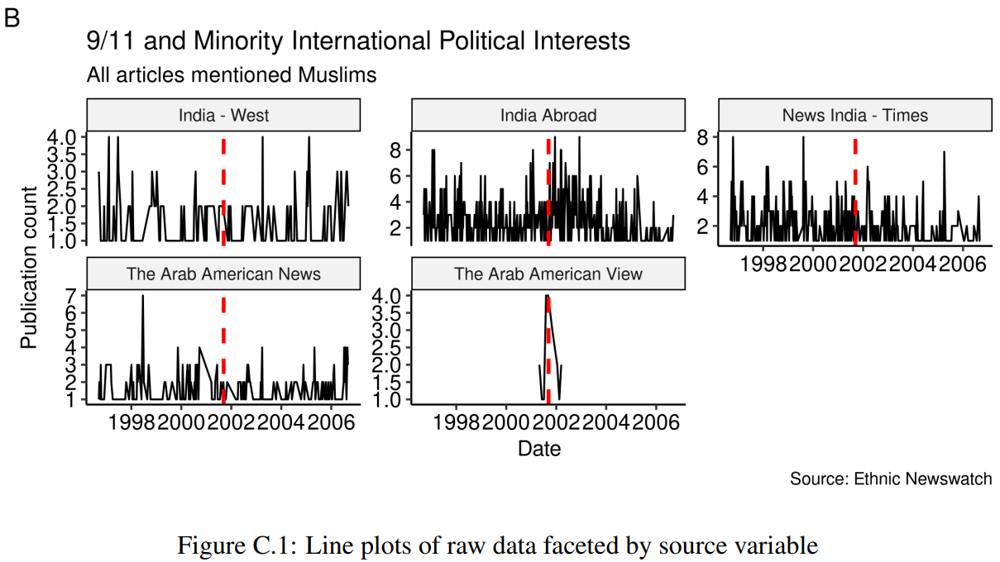
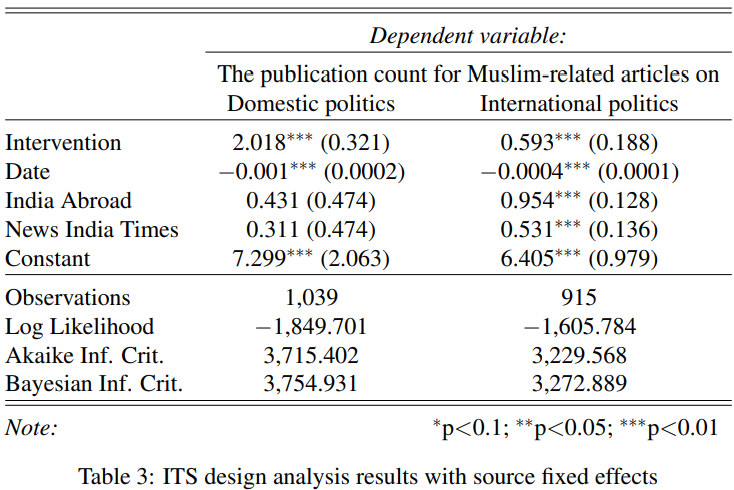
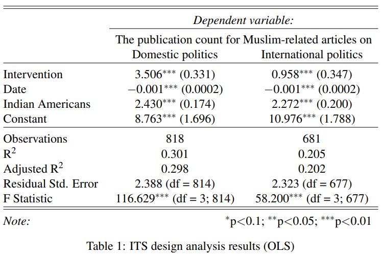

```{r xaringan-themer, include=FALSE, warning=FALSE}

library(xaringanthemer)

style_mono_accent(
  base_color = "#23395b",
  header_font_google = google_font("Josefin Sans"),
  text_font_google   = google_font("Montserrat", "300", "300i"),
  code_font_google   = google_font("Fira Mono")
  
)

```

# Data availability and social science research 


The streetlight effect: **data availability** constrains the **scope** of research **questions** and **methods**. 

---

# Quantitative research on marginalized populations 

It's **relatively** easy to assess how the majority group is **biased** against minority groups, but it's difficult to investigate how minority groups **experience** and **internalize** bias using quantitative methods.  

---

# Current options and their limitations 

1. Qualitative research: generalizability

2. Survey research: temporal scope and group heterogeneity

3. Experimental research: snapshots and artificial treatments

---

# Main challenge and opportunity 

* How can we do a **large-scale**, **well-designed**, and **efficient** observational study on marginalized populations?

---

# Why ML and automation matter

1. Machine learning enables data-intensive research on marginalized populations. (You can think of a prediction as part of the complex research design.)

2. Automating research process helps increase research transparency, reproducibility, and scalability.

---

# 9/11 as a natural experiment 


.pull-left[
 September 11 attacks]

.pull-right[
* Exogenous shock -> Interrupted time series design 

* Time is not random!
]
---

# 9/11 as a natural experiment 


]

---

# Threats and information seeking 


---

# Ethnic newspaper as an alternative data source 


---

# Data sources 

Data source: Ethnic NewsWatch database (**2.5 million** articles collected over the last **four decades**)

Raw data: 1,132 **Arab** and 4,552 **Indian American** newspaper articles mentioning **Muslims** published between **1996 and 2006**

---

# Argument

* Threats -> information seeking (Valentino et al. 2008; Albertson and Gadarian 2015)

* Information seeking -> the demand for news reports on these threats.

---

# Research question and outcome measures 

**Q**: When immigrant communities become more interested in U.S. domestic rather than home country politics?

**DV**: The Muslim related articles: Domestic politics (e.g., War on Terrorism) + International politics (e.g., territorial disputes)

---

# Hypotheses

**H1** (domestic politics): The September 11 attacks made Arab American and Indian American newspapers publish more articles on U.S. political news related to Muslim communities in the post-9/11 period than in previous years. (**Strong**)

---

# Hypotheses 

**H2** (international politics: Arab American and Indian American newspapers published more articles on Muslim populations outside than inside the U.S. in the post-9/11 period than in the pre-intervention period. (**Null/Weak**)

---


# Workflow 

* Step 1: Digital (text) data collection 

* Step 2: Training algorithms (classifiers) 

* Step 3: Automated text classification 

* Step 4: Interrupted time series design analysis 

---

# What raw data look like 



---

# Automating digital data collection 

* Developed an [R package]( https://jaeyk.github.io/tidyethnicnews/) for turning Ethnic NewsWatch search results into tidy dataframe

* The package took average 0.0005 seconds to parse 100 newspaper articles (it took only 12.34 seconds to parse 5,684 articles for this research).

---

# Labeling articles = prediction problem 

1. Annotators (two authors + three RAs) label 1,015 articles (18% of the total data).

2. Machines learn how to label articles using the human-labeled articles (training).

3. Algorithms (classifiers) label the rest of the articles.  

---

# Machine learning approach 

- Used Lasso (Least Absolute Shrinkage and Selection Operator). Or OLS + penalty for the sum of the absolve coefficients of the model parameters (i.e., terms).

- Reasonable because (1) text data is high-dimensional and (2) the pattern could be explained by few key terms (simpler + faster). 

---

# Machine learning performance 

* Accuracy (overall performance): 73%

* Precision (aka positive predictive value): 75%

* Recall (aka true positive rate): 80%

Replication code is available at https://github.com/jaeyk/ITS-Text-Classification

---

# Relative word frequencies 


---

.pull-left[ **Raw data**
]

.pull-right[ **ITS design**
]

---

.pull-left[ **Placebo test**
]

.pull-right[ **GLS model**
]

---

# Regression table 



---

# Research pipeline 

1. Mining text data + applying ML (1 forthcoming, 2 under review papers)

2. Building original organizational data + combining with other data sources (1 published and 1 R&R) 

* Big & complex data + ML + other methods -> data-intensive social science research on marginalized groups

---

# Research software 

* All of my research projects are computationally reproducible and available on the GitHub. 

* These computational projects produce 1) articles, 2) software, and 3) new datasets. 

* So far, I have developed two R packages that help researchers collecting large text data at scale.

---

# Current research focus 

Mapping the Modern Agora project (with Hahrie Han and Milan de Vries at P3 Lab at the SNF Agora Institute at JHU):

Creating big data infrastructure for investing political organizing in the US based on more than 3 million tax reports.

---

# Conclusion 

* Data science + Social science (=computational social science) for social good

* Giving voice to the marginalized groups 

* Analyzing how people organize, build power, and respond to and change policies 

---
# Appendix A Ethnic NewsWatch Datbase 



---

# Appendix A Ethnic NewsWatch Datbase 



---

# Appendix B Autocorrelation test



---

# Appendix C Newspaper source analysis



---

# Appendix C Newspaper source analysis



---

# Appendix C Newspaper FE



---

# Appendix D OLS

